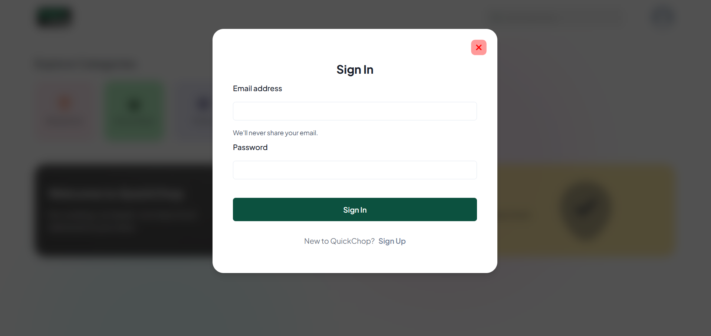
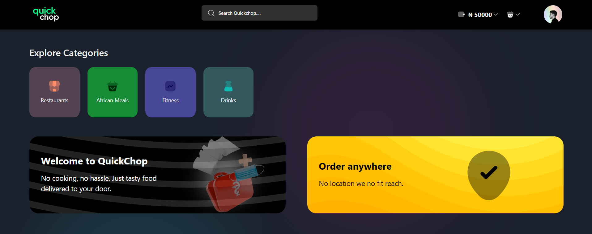
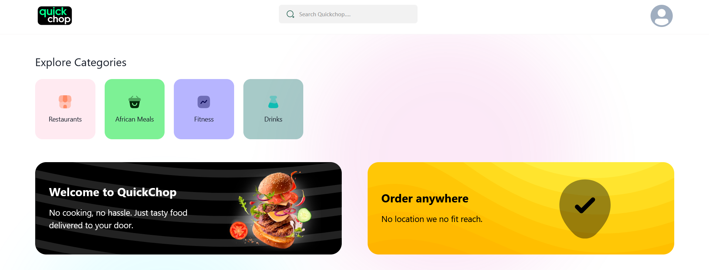

# Food Delivery Next.js App

This is a food delivery app built using Next.js.
💻 <a href="https://github.com/ElSierra/Quick-chop-api.git">Backend Node.js Repo</a>

## Screenshots

|  | 
|:--:| 
| *Login* |

|  | 
|:--:| 
| *Home (Dark)* |

|  | 
|:--:| 
| *Home (Light)* |


## Getting Started

To get started with the app, clone the repo and then install the necessary dependencies:

```bash
npm install
npm run dev
```

The app should now be running at http://localhost:3000.

## Built With

- Next.js - The web framework used
- React - A JavaScript library for building user interfaces
- Node.js - A JavaScript runtime
- Redux - For State management

## Contributing

Contributions are welcome! If you'd like to contribute, please fork the repository and make changes as you'd like. Pull requests are warmly welcome.

## License

This project is licensed under the MIT License - see the LICENSE.md file for details.

## Acknowledgments

- The Next.js documentation - A great resource for learning Next.js
- The MongoDB documentation - A comprehensive guide to using MongoDB
- The React documentation - A fantastic reference for building React applications.
